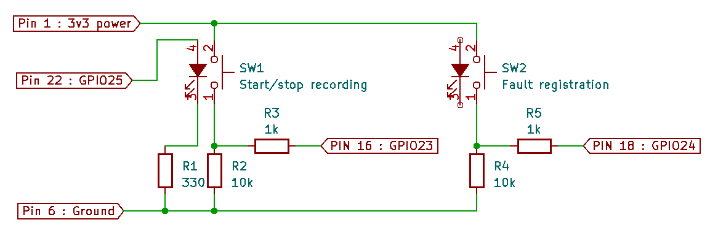

# Audio recorder with Pi and Zoom H1

## Goal
In order to record audio as data samples for training a AI model we needed a device that we can setup in the production line and can be started and stopped as needed. All recordings are by default pass, when a faulty product is recorded this must be labeled as so.

## Hardware
We use a Raspberry Pi 4 and Zoom H1 microphone for the recordings.
Connections are made as follows:


In order to be able to place the hardware in an production environment a box was created that will be 3D printed (stl-files included in the cad-folder).


## Firmware

### OS
We used a clean install of Raspberry Pi OS with the default user `pi` and password `raspberry`.

## Python libraries
We will be using the Python library `pyaudio` to record the audio data from the USB mic. 

Before we can get started with `pyaudio`, we need to ensure that the RPi has all the necessary prerequisites by installing the following packages:

```bash
sudo apt-get install libportaudio0 libportaudio2 libportaudiocpp0 portaudio19-dev
```

If the above is successful, then we can download the ‘pyaudio’ library:

```bash
sudo pip3 install pyaudio
```

### Source code 

We developed a Python script for this application that runs an endless loop and uses callback functions triggered by the push buttons or a time interval.

To write a new line to the log file a function has been made:
```python
def writeLog(message):
    print(message)
    with open("recording_log.txt", "a") as f:
        f.write(message+'\n')
```
Note: if the file doesn't exists it is been made.

When the recording starts a function is used to determine the next filename for the .WAV file:

```python
def getFilename():
    i=1
    filename = 'qcontrole_'+str(i).zfill(3)+'.wav'
    while(os.path.isfile('/home/pi/'+filename)):
        i += 1
        filename = 'qcontrole_'+str(i).zfill(3)+'.wav'        
    return filename
```
All files are written to the `/home/pi` folder. 8 hour recording is to be estimated 5 Gb data, so your SD-card will need to have that free space.

To start recording the following function is made:
```python
def startRecording():
    global recfile, t
    filename = getFilename()
    recfile = rec.open(filename, 'wb')
    writeLog('Start recording to '+filename+' - '+datetime.datetime.now().strftime("%d/%m/%Y %H:%M:%S"))
    recfile.start_recording()
    GPIO.output(led_out,1)
```
This starts a new .WAV file and makes a entry in the logfile. Also, the led is turned on so the operator knows the recording has started.

To be able to stop recording the next function was created:
```python
def stopRecording():
    global recfile, t
    recfile.stop_recording()
    recfile.close()
    GPIO.output(led_out,0)
```
The current .WAV file is finalized and the led is turned off.

Next a timer callback function is made to be able to cut the recordings in parts of 5 minutes.

```python
def nextFile():
    if(recordStatus):
        stopRecording()
        time.sleep(1)
        startRecording()
        t = threading.Timer(interval, nextFile)
        t.start()
```
This just calls the stop and start recording functions and starts the next timer of 5 minutes.

Because we use the same button to start and stop the recordings we must make a toggle function:
```python
def startstop_callback(channel):
    global recordStatus, t
    if(GPIO.input(startstop_switch)):
            recordStatus = not recordStatus
            if(recordStatus):
                startRecording()
                t = threading.Timer(interval, nextFile)
                t.start()
            else:
                stopRecording()
                writeLog("Stop recording")
                t.cancel()
```

As last, we also need a function to record faulty products:

```python
def fault_callback(channel):
    writeLog('Fault registered - '+datetime.datetime.now().strftime("%d/%m/%Y %H:%M:%S"))
```
### Functionality
This python program starts recording audio when a button is pushed.
The recordings are being written to .WAV files. Each 5 minute period a next .WAV file is used to prevent having one large file that could be corrupt.
The recordings can be stopped and started again as needed.
Start and stop times are logged to a log file.
When the device is recording this is indicated by a led.
When a faulty product has been recorded, the operator pushes a second button, when doing so the time is also logged to the logfile with a fault label.

## Run script on startup

We wanted to have a plug&play device that is ready to use when powered on. So the python script must be started when the device is booted. There are different ways to achieve this, we chose the systemd approach.

1. Create a unit file

```bash
sudo nano /lib/systemd/system/audiorecorder.service
```

Add the following content:

```ini
[Unit]
Description=Audio Recorder Service
After=multi-user.target

[Service]
Type=idle
ExecStart=/usr/bin/python /home/pi/audiorecorder.py
WorkingDirectory=/home/pi
User=pi
Restart=on-abort

[Install]
WantedBy=multi-user.target
```
2. Set permission  for the unit file

```bash
sudo chmod 644 /lib/systemd/system/audiorecorder.service
```

3. Configure systemd
Now the unit file has been defined we can tell systemd to start it during the boot sequence :

```bash
sudo systemctl daemon-reload
sudo systemctl enable audiorecorder.service
```

Reboot the Pi and your custom service should run :

```bash
sudo reboot
```

## Use of recordings
We aim to use Edge Impulse to cut the data in samples and label them pass and fault. We will then try to train an AI model that can be deployed on a microcontroller to perform the quality control in real-time.
